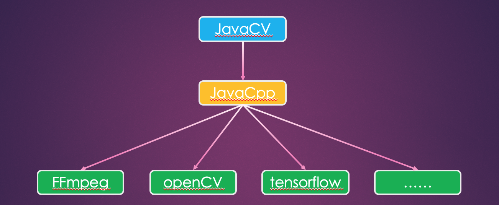

# cv-mac-spring-boot-starter
## 1.JavaCV是什么？
```
百度百科解释：
    JavaCV [1]  是一款基于JavaCPP [2]  调用方式（JNI的一层封装），由多种开源计算机视觉库组成的包装库，
    封装了包含FFmpeg、OpenCV、tensorflow、caffe、tesseract、libdc1394、OpenKinect、videoInput和ARToolKitPlus等在内的计算机视觉领域的常用库和实用程序类。
``` 
---
```
JavaCV利用JavaCPP在FFmpeg和Java之间构建了桥梁，我们通过这个桥梁可以方便的调用FFmpeg。
调用了ffmpeg之于jvm是native方法，所以通过ffmpeg创建的结构体实例与常量、方法等等都是使用堆外内存，所以需要手动的释放这些资源，
以防止发生内存溢出/泄露等风险。
```
---


常用类有：FrameGrabber、FrameRecorder、FrameFilter等
---
## 2.JavaCV可以做哪些事情？
```
JavaCV是计算机视觉领域的Java库，可以处理音视频，流媒体，图像处理，智能识别等工作。
```
---
## 3.如何使用cv-mac-spring-boot-starter？

(1) springboot项目中直接引用下面的依赖
```
<dependency>
    <groupId>cn.lishaoshuai</groupId>
    <artifactId>cv-mac-spring-boot-starter</artifactId>
    <version>1.0.3</version>
</dependency>
```

(2) 注入bean
```java
//引入javaCVService,就可以使用其中封装好的方法
@Autowired JavaCVService javaCVService;

```
